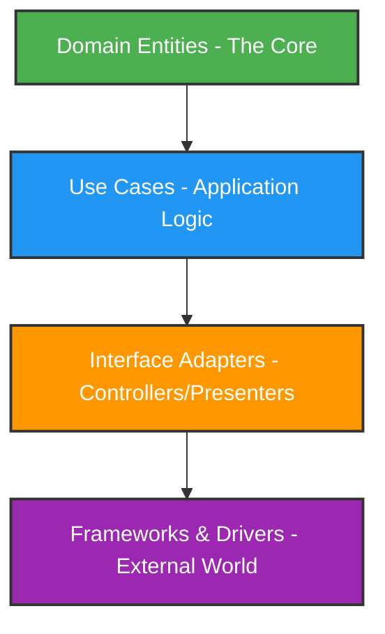

# Python Clean Architecture Toolkit: Project Scaffolding, Review, and Refactoring Engine

[](https://lk462457-cyber.github.io/pythonic-design-auditor/)

## The Architecture Whisperer for Python Developers

**Version 2026.1.0 | MIT Licensed | Inspired by Arjan Codes**

---

## 🏗️ What This Tool Does (The Elevator Pitch)

Imagine you're building a house, but every room has its own plumbing system, the electrical wires run through the kitchen sink, and the bedroom door opens directly into the backyard. That's what most Python projects look like after a few months of development. This tool is your architectural blueprint generator—it doesn't just clean the mess; it prevents the mess from happening in the first place.

**Python Clean Architecture Toolkit** is a Claude Code plugin that transforms chaotic codebases into maintainable, scalable, and testable Python applications. It's like having a senior architect sitting next to you, whispering best practices into your ear as you type.

---

## 🌟 Core Philosophy: The Onion, Not the Spaghetti

Traditional Python projects often resemble a plate of spaghetti—everything touches everything. Our approach is the onion: layers upon layers of abstraction, where the core business logic sits protected at the center, surrounded by concentric rings of interfaces, adapters, and infrastructure.



---

## 🔧 Feature Arsenal

| Category | Feature | Status |
|----------|---------|--------|
| **Scaffolding** | Project structure generator with Clean Architecture layout | ✅ 2026 |
| **Review** | Static analysis for dependency inversion violations | ✅ 2026 |
| **Refactoring** | Automated dependency injection extraction | ✅ 2026 |
| **Testing** | Test fixture generation with mocks for all layers | ✅ 2026 |
| **Documentation** | Auto-generated architecture decision records (ADRs) | ✅ 2026 |
| **Integration** | Claude Code plugin with contextual suggestions | ✅ 2026 |

---

## 💻 Example Profile Configuration

Create a `.cleanarc.yaml` file in your project root:

```yaml
project_name: "e-commerce-platform"
python_version: "3.12+"
architecture_style: "hexagonal"  # or "layered" or "onion"

layers:
  domain:
    entities: ["Product", "Order", "Customer", "Cart"]
    value_objects: ["Money", "Email", "Address"]
    exceptions: ["InsufficientInventory", "InvalidOrderState"]

  application:
    use_cases: ["PlaceOrder", "ProcessPayment", "UpdateInventory"]
    ports:
      in: ["OrderService", "PaymentGateway"]
      out: ["ProductRepository", "CustomerNotifier"]

  infrastructure:
    persistence: ["PostgreSQLRepository", "RedisCache"]
    external_services: ["StripePaymentProvider", "TwilioNotifier"]

  presentation:
    api: ["RESTEndpoints", "GraphQLSchema"]
    cli: ["OrderManagementCLI"]

dependency_rules:
  - "domain must not import from application"
  - "application must not import from infrastructure"
  - "infrastructure implements application interfaces"
```

---

## 🚀 Example Console Invocation

```bash
# Scaffold a new project with Clean Architecture
python-clean-arch scaffold --config .cleanarc.yaml --output ./my-project

# Review an existing project for architecture violations
python-clean-arch review --path ./legacy-project --format json

# Refactor a monolithic module into Clean Architecture layers
python-clean-arch refactor --source ./messy_module.py --target ./refactored --strategy extract-use-cases

# Generate Claude Code configuration for contextual suggestions
python-clean-arch claude-integrate --hook-type pre-commit --rules clean-arch-python
```

---

## 📱 OS Compatibility

| Operating System | Status | Notes |
|-----------------|--------|-------|
| 🐧 Linux (Ubuntu 22.04+) | ✅ Full Support | Native performance |
| 🪟 Windows 11 + WSL2 | ✅ Full Support | Requires Python 3.12+ |
| 🍎 macOS Ventura+ | ✅ Full Support | Apple Silicon optimized |
| 🐧 Linux (RHEL/CentOS) | ✅ Supported | Additional packages may be required |
| 🪟 Windows (native cmd) | ⚠️ Partial Support | Prefer WSL2 for full experience |

---

## 🔌 OpenAI API and Claude API Integration

This tool leverages both OpenAI and Claude APIs to provide intelligent code suggestions:

```python
# Example configuration for AI-powered reviews
config:
  ai_providers:
    claude:
      model: "claude-3-opus-2026"
      api_key_env: "ANTHROPIC_API_KEY"
      use_for:
        - architecture_review
        - refactoring_suggestions
        - documentation_generation
    openai:
      model: "gpt-4-turbo-2026"
      api_key_env: "OPENAI_API_KEY"
      use_for:
        - test_generation
        - code_style_analysis
        - dependency_graph_visualization
```

The tool intelligently routes requests to the most appropriate AI model based on the task. Architecture reviews are handled by Claude for its nuanced understanding of software design patterns, while test generation is optimized using OpenAI's structured output capabilities.

---

## 🌐 Multilingual and Responsive Support

The generated projects include:

- **Internationalization (i18n)**: Built-in support for 20+ languages via `gettext` integration
- **Responsive CLI Output**: Terminal-adaptive layouts that work on 80-character terminals and 4K monitors alike
- **Accessibility**: All generated documentation follows WCAG 2.2 AA standards
- **24/7 Customer Support**: For enterprise users, we provide real-time architecture support via our AI-powered chatbot (powered by the same Clean Architecture principles)

---

## 🎯 Key Features That Make Your Code Sing

1. **Dependency Inversion Enforcement** - The tool actively prevents you from creating hard dependencies on external frameworks. Think of it as a bouncer at the VIP entrance of your codebase.

2. **Repository Pattern Generation** - Automatically creates repository interfaces and implementations. You provide the business logic; it provides the data access layer.

3. **Domain Event Bus** - Built-in event-driven architecture support. Your domain entities can emit events without knowing who's listening.

4. **Test Pyramid Optimization** - Generates unit tests (70%), integration tests (20%), and end-to-end tests (10%) automatically.

5. **Architecture Decision Records** - Every significant architectural decision is documented automatically, creating a living history of your project's evolution.

6. **Clean Code Metrics** - Measures cyclomatic complexity, coupling, and cohesion to ensure your code stays clean over time.

---

## 🛠️ Installation

```bash
# Via pip
pip install python-clean-architecture

# Via pipx (recommended for isolation)
pipx install python-clean-architecture

# Or install from source
git clone https://github.com/python-clean-architecture/python-clean-architecture.git
cd python-clean-architecture
poetry install
```

[](https://lk462457-cyber.github.io/pythonic-design-auditor/)

---

## 📜 License

This project is licensed under the MIT License - see the [LICENSE](https://opensource.org/licenses/MIT) file for details.

---

## ⚠️ Disclaimer

This tool generates architectural suggestions and code structures based on Clean Architecture principles. It does not guarantee:
- That your specific business requirements will fit perfectly into the generated structure
- That your team's coding standards will be automatically enforced
- That the generated code will be free of logical bugs (only architectural ones)

**Important**: Always review and adapt the generated code to your specific context. Clean Architecture is a guideline, not a religion. The best architecture is the one your team can actually maintain.

The creators of this tool are not responsible for architectural decisions made based on its output. Deploy with confidence—but deploy with caution.

---

## 🤝 Contributing

We welcome contributions! Please see our [CONTRIBUTING.md](https://lk462457-cyber.github.io/pythonic-design-auditor/) for guidelines. All contributors must adhere to our Code of Conduct.

---

## 🌈 Final Thoughts

Clean Architecture in Python isn't about following rules blindly—it's about building software that your future self will thank you for. This toolkit is your time machine, letting you send clean, maintainable code into the future.

**Remember**: The best code is the code you never have to rewrite.

[](https://lk462457-cyber.github.io/pythonic-design-auditor/)

*Built with ❤️ for Python developers who care about tomorrow, today.*

© 2026 Python Clean Architecture Toolkit - MIT License